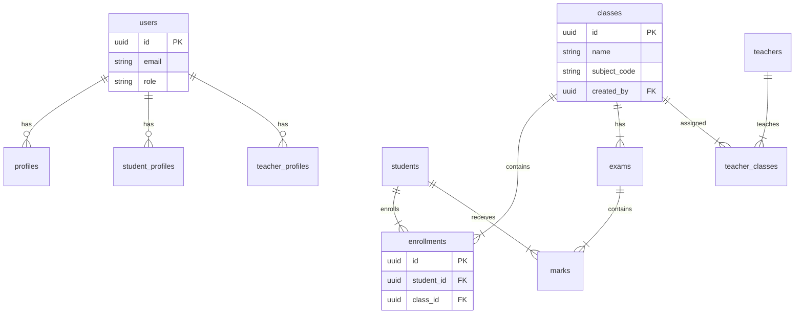

# System Architecture

## Overview
Campus Flow follows a modern client-server architecture with a separate frontend and backend, leveraging Supabase for database, authentication, and real-time capabilities.

## 📐 High-Level Architecture

```mermaid
graph TD
    Client[Client (React/Vite)]
    LB[Load Balancer / Nginx]
    API[Express Backend API]
    Supabase[Supabase Platform]
    DB[(PostgreSQL Database)]
    Auth[Supabase Auth]
    Realtime[Supabase Realtime]
    Storage[Supabase Storage]

    Client -->|HTTP/REST| LB
    LB -->|HTTP| API
    Client -->|WebSocket| Realtime
    
    API -->|PostgREST/Client| Supabase
    Supabase --> DB
    Supabase --> Auth
    Supabase --> Storage
    
    Client -.->|Direct Auth| Auth
    API -.->|Verify Token| Auth
```

## 🔄 Data Flow

### 1. Authentication
- User logs in via Frontend using Supabase Auth.
- Supabase returns a JWT.
- Frontend attaches JWT to API requests (`Authorization: Bearer <token>`).
- Backend verifies JWT using `authMiddleware`.

### 2. Real-time Updates
- Frontend subscribes to database changes via `useRealtime` hook.
- Supabase Realtime broadcasts `INSERT`, `UPDATE`, `DELETE` events.
- Frontend updates UI (e.g., new notification, marks update) instantly without polling.

### 3. File Uploads
- Frontend selects file -> Backend (`/api/upload`).
- Backend validates file (Multer) -> Uploads to Supabase Storage.
- Backend returns file path/URL.
- Frontend displays file using URL.

## 🗄 Database Schema (Key Tables)



## 🛡 Security Measures

1.  **JWT Authentication**: Stateless, secure token-based auth.
2.  **Row Level Security (RLS)**: Database-level access control (even if API is bypassed).
3.  **Helmet**: Sets secure HTTP headers (XSS protection, etc.).
4.  **Rate Limiting**: Prevents abuse (200 req/15min).
5.  **Input Validation**: Backend validation for all inputs.
6.  **CORS**: Restricted cross-origin access.

## 🚀 Performance Optimizations

1.  **Pagination**: `page` and `limit` on heavy endpoints (Students, Classes, Enrollments, Marks).
2.  **Selective Querying**: Fetching only required fields (e.g., `student(id, name)` instead of `*`).
3.  **Real-time Push**: Eliminates expensive polling.
4.  **Connection Pooling**: Managed by Supabase.
